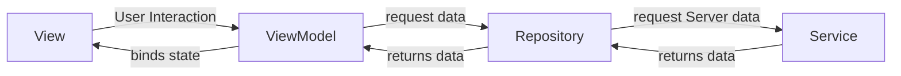

# Horse Race


## Overview

  The **Horse Racing App** is a dynamic and interactive application designed for racing enthusiasts. It provides real-time updates about upcoming horse racing events, making it easy for users to stay informed and track races efficiently. Leveraging the **MVVM architecture** and **SwiftUI**, the app fetches data from a server through an API and presents it in a clean, user-friendly interface.


## **Feature**

The app retrieves horse racing data from a server and displays it in a structured, filtered list. Users can browse through a maximum of five upcoming races, categorized into three distinct types:

1.  **Horse Racing**
2.  **Greyhound Racing**
3.  **Harness Racing**

The list dynamically updates to show races that have yet to begin. Races that have already started and elapsed for more than 60 seconds are excluded from the display, ensuring users see only relevant and timely information.

  ### **Race List**

The app's primary screen displays a concise list of the next five upcoming races. Each race entry includes the following details:


1.  **Category Image**: A thumbnail representing the category of the race (e.g., Horse, Greyhound, or Harness).
2.  **Race Number**: The unique identifier for each race (e.g., _R1_).
3.  **Meeting Name**: The location or event name where the race will take place.
4.  **Advertised start** *(Countdown Timer)* :
    -   Shows the remaining time until the race starts, such as `4m 5s` (4 minutes and 5 seconds).
    -   Displays a countdown of less than a minute, such as `22s` (22 seconds left).
    -   If a race has already started, it shows elapsed time with a negative value, such as `-20s` (race began 20 seconds ago).
    -   **Important**: Races that have elapsed more than 60 seconds are automatically removed from the list.

### **Filters by Category**

The app provides users with the ability to filter races by their specific categories, ensuring a highly organized and tailored viewing experience. Users can toggle between the following categories:

1.  **Horse Racing**
2.  **Greyhound Racing**
3.  **Harness Racing**


Alternatively, users can **remove all filters** to view a comprehensive list of all races across all categories. When no filter is applied, the races are displayed in **ascending order of their advertised start time**, allowing users to see the upcoming events chronologically.


----------

### Preview


----------
## Flow



------

## Folder Structure

```
HorseRacingApp/
├── core/
│   ├── Colors.swift
│   ├── ViewState.swift
│   ├── Extensions.swift
├── feature/
│   ├── model/
│   │   ├── Race.swift
│   │   ├── RaceCategory.swift
│   ├── view/
│   │   ├── RaceListView.swift
│   │   └── RaceRowView.swift
│   ├── view model/
│   │   ├── RaceViewModel.swift
│   │   ├── TimerViewModel.swift
│   └── service/
│       ├── RaceService.swift
│   └── repository/
│       ├── RaceRepository.swift
├── network/
│   ├── NetworkManager.swift
│   ├── NetworkError.swift
│   └── Endpoint.swift
│
│
└── Tests/
    ├── RaceViewModelTests/
    │   ├── RaceViewModelTests.swift
    │   ├── RaceViewModelFilteringTests.swift
    │   ├── RaceViewModelAutoRefreshTests.swift
    │   └── RaceViewModelErrorHandlingTests.swift
    ├── Mocks/
    │   ├── MockRaceRepository.swift
    │   ├── MockRaceService.swift
    │   └── MockData.swift
    └── network/
        └── NetworkTests.swift

```

