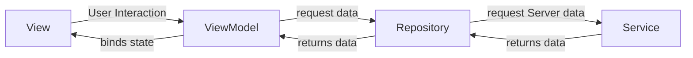
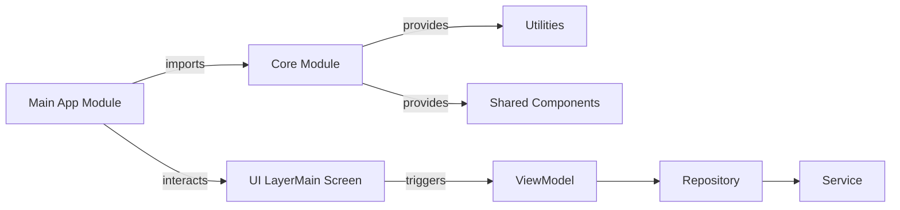

# Horse Race


## Overview

  The **Horse Racing App** is a dynamic and interactive application designed for racing enthusiasts. It provides real-time updates about upcoming horse racing events, making it easy for users to stay informed and track races efficiently. Leveraging the **MVVM architecture** and **SwiftUI**, the app fetches data from a server through an API and presents it in a clean, user-friendly interface.

## Installation

To run this project locally, clone the repository and open it in Xcode.
```bash
git clone https://github.com/kapilmhr/horse-race.git
cd horse-race
open horse_racing.xcodeproj
```

Ensure you have the latest version of Xcode and an iOS device or simulator set up.

### SwiftLint Installation and Setup for Xcode
#### Installation with Homebrew (Recommended)
```bash 
brew install swiftlint
```
####  Integrating SwiftLint into Xcode
-   Open your Xcode project. 
-   Go to your **Target** > **Build Phases**.
-   Click the **+** button and select **New Run Script Phase**.
-   In the new **Run Script Phase**, add the following script:
```bash
if which swiftlint >/dev/null; then
  swiftlint
else
  echo "Warning: SwiftLint not installed, install it via Homebrew."
fi
```
> Ensure the **Run Script Phase** is placed after **Compile Sources**.

#### Configuring SwiftLint (Optional)

1.  Create a `.swiftlint.yml` file at the root of your project.
    
2.  You can customize the rules and behavior by modifying this `.swiftlint.yml` file.


## **Feature**

-   **Real-Time Updates:** Fetches horse racing data from a server and displays it in an organized, filtered list.
-   **Race Categories:** Displays races in three main categories:
    -   Horse Racing
    -   Greyhound Racing
    -   Harness Racing
-   **Upcoming Races:** The app shows the next five upcoming races, ensuring users stay up to date with events.
-   **Race Filtering:** Users can filter races by category for a more tailored experience or view all categories at once.
-   **Race Countdown:** Displays a countdown timer showing the remaining time until each race starts. If a race has already started, the elapsed time is shown.
-   **Timely Information:** Races that have already started and elapsed for more than 60 seconds are automatically removed from the list, ensuring that only relevant races are displayed.

  ### **Race List**

The app's primary screen displays a concise list of the next five upcoming races. Each race entry includes the following details:


1.  **Category Image**: A thumbnail representing the category of the race (e.g., Horse, Greyhound, or Harness).
2.  **Race Number**: The unique identifier for each race (e.g., _R1_).
3.  **Meeting Name**: The location or event name where the race will take place.
4.  **Advertised start** *(Countdown Timer)* :
    -   Shows the remaining time until the race starts, such as `4m 5s` (4 minutes and 5 seconds).
    -   Displays a countdown of less than a minute, such as `22s` (22 seconds left).
    -   If a race has already started, it shows elapsed time with a negative value, such as `-20s` (race began 20 seconds ago).
    -   **Note**: Races that have elapsed more than 60 seconds are automatically removed from the list.

### **Filters by Category**

The app provides users with the ability to filter races by their specific categories:

1.  **Horse Racing**
2.  **Greyhound Racing**
3.  **Harness Racing**


Alternatively, users can **remove all filters** to view a comprehensive list of races across all categories. When no filter is applied, races are displayed in ascending order based on their advertised start time, ensuring a chronological view of upcoming events.


----------

### Preview


----------
## Architecture
### 1. MVVM
This app uses the **MVVM (Model-View-ViewModel)** architecture to manage data and business logic. The **SwiftUI** framework is employed for building a declarative, responsive UI. 


### Flow



------

-   **View**: Displays the UI and captures user interactions.
-   **ViewModel**: Handles user interaction logic, requests data, and binds data to the view.
-   **Repository**: Manages data fetching from multiple sources, including network requests.
-   **Service**: Responsible for making network requests to fetch data from the server.

 *Data flows from the Service to the Repository, from the Repository to the ViewModel, and then the ViewModel binds the data to the View.*
 
## Folder Structure

```
HorseRacingApp/
├── core/
│   ├── Colors.swift
│   ├── ViewState.swift
│   ├── Extensions.swift
├── feature/
│   ├── model/
│   │   ├── Race.swift
│   │   ├── RaceCategory.swift
│   ├── view/
│   │   ├── RaceListView.swift
│   │   └── RaceRowView.swift
│   ├── view model/
│   │   ├── RaceViewModel.swift
│   │   ├── TimerViewModel.swift
│   └── service/
│       ├── RaceService.swift
│   └── repository/
│       ├── RaceRepository.swift
├── network/
│   ├── NetworkManager.swift
│   ├── NetworkError.swift
│   └── Endpoint.swift
│
│
└── Tests/
    ├── RaceViewModelTests/
    │   ├── RaceViewModelTests.swift
    │   ├── RaceViewModelFilteringTests.swift
    │   ├── RaceViewModelAutoRefreshTests.swift
    │   └── RaceViewModelErrorHandlingTests.swift
    ├── Mocks/
    │   ├── MockRaceRepository.swift
    │   ├── MockRaceService.swift
    │   └── MockData.swift
    └── network/
        └── NetworkTests.swift

```

### 2. Modular Architecture

The `core` module is imported into the `main app` module



### Folder Structure

```
├── core/
│   ├──/MainApp
│   ├── MainView.swift
│   ├── /CoreModule (from MyLibrary)
│   │   ├── Utilities/
│   │   │   ├── Extensions.swift
│   │   │   └── Helpers.swift
│   │   └── SharedComponents/
│   │       ├── LoadingIndicator.swift
│   │       └── CustomView.swift
|   ├── /feature
└── /Package.swift
```


## Testing

To ensure the app works as expected, we have a comprehensive suite of unit and UI tests. Follow the steps below to run tests and view test coverage reports.

### **Run All Tests**:  
    In Xcode, navigate to the top menu and select:
```bash
Product > Test
```
> Alternatively, you can press `Cmd + U` to run all tests in the project.

### Coverage

Test coverage is tracked to ensure that key parts of the code are properly tested. After running the tests, you can view the coverage report in Xcode.


